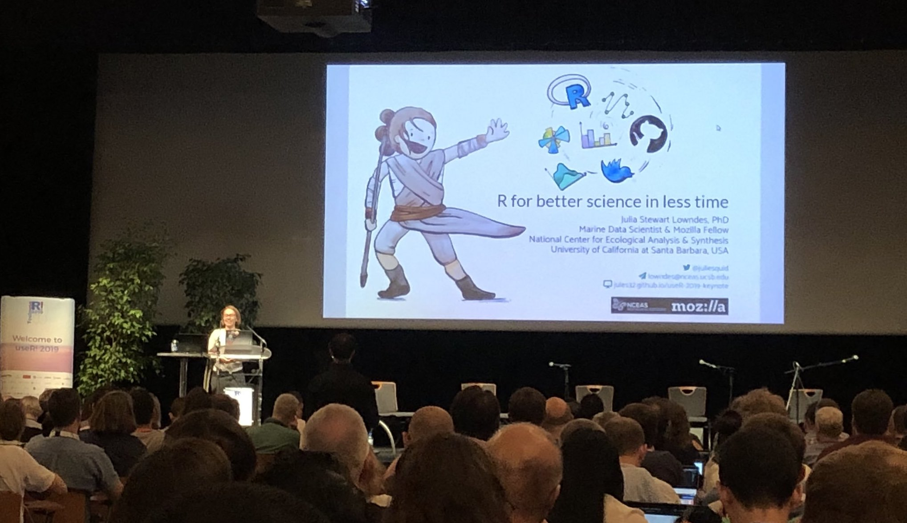
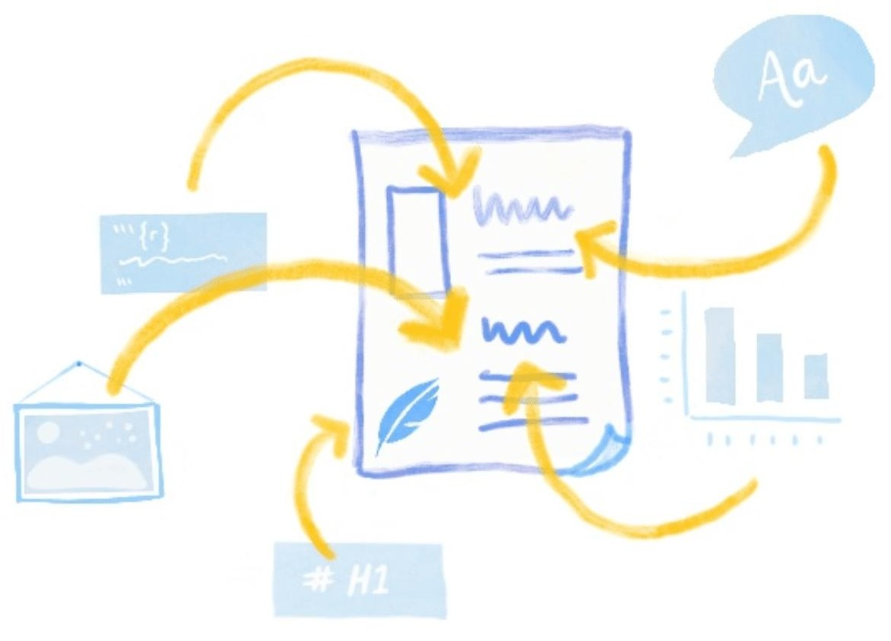
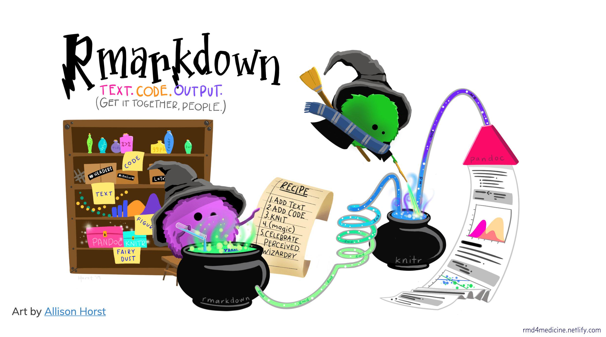

# El software `R` {#R}

## ¿Qué es `R`?

`R` es un lenguaje de programación creado por Robert Gentleman y Ross Ihaka en el año de 1992. Su intención consistio en hacer un lenguaje didáctico, para ser utilizado en un curso introductorio a la estadística en la Universidad de Nueva Zelanda. Ambos creadores le dieron el nombre de `R` al lenguaje implementado por las iniciales de sus nombres (a modo de broma).

```{r Figura 1.1, echo = FALSE, out.width = '30%', fig.align = 'center', fig.cap = 'Los creadores del Software R **Robert Gentleman** (a la derecha) y **Ross Ihaka** (a la izquierda).'}
knitr::include_graphics("Imagenes/Creadores.jpg")
```

El lenguaje de programación `R` se puede obtener y distribuir de forma gratuita, debido a que se encuentra bajo Licencia Pública General del proyecto GNU<sup>1</sup>. `R` es un programa de código abierto, gratis, y fruto del esfuerzo de miles de personas en todo el mundo que colaboran en su desarrollo.

```{r Figura 1.2, echo = FALSE, out.width = '30%', fig.align = 'center', fig.cap = 'Encuentro en el **useR!** 2019. Este evento,  realizado anualmente en todo el mundo, se considera como la principal reunión del lenguaje `R`.'}

```

De hecho esta última característica del `R` es muy importante, puesto que al contar con una comunidad es posible dar con la solución de problemas de errores en programación (*bugs*), así como desarrollar paquetes modulares utilizados en temas específicos, desarrollados por personas con conocimiento variado en alguna parte del mundo.

En la [web](https://www.r-project.org/index.html) hay todo tipo de información de interés acerca del `R`, como por ejemplo su instalación a través de la CRAN (Comprehensive R Archive Network).

<div style="-moz-box-shadow: 1px 1px 3px 2px #000000;
  -webkit-box-shadow: 1px 1px 3px 2px #000000;
  box-shadow:         1px 1px 3px 2px #000000;">
> <i class="fa fa-paperclip"></i>
<sup>1</sup>El proyecto **GNU** tuvo como propósito desarrollar un sistema operativo compatible con Unix que fuera software libre. Si desea conocer información sobre el mismo, consulte [aquí](http://www.gnu.org/) por favor.
</div>

## Usando `R`: lo básico
<!--
Si rara vez ha usado `R` o nunca antes, a continuación brindaremos información suficiente para poder comenzar y comprender el código `R` que se usara en gran parte de este escrito.
-->

## Informes reproducibles

Hoy en día es posible crear informes que, además de contener el texto que compone el manuscrito, contiene tanto el código que genera las figuras como los estadísticos. En esto consiste un **informe reproducible**, y esta característica (texto, código y estadísticos) es lo que los hace diferente a cualquier otro documento.

```{r Figura 1.3, echo = FALSE, out.width = '40%', fig.align = 'center', fig.cap = '.'}

```

Escribir un informe reproducible tiene numerosas virtudes, como por ejemplo:

  - Aumenta la transparencia de su ciencia al automatizar la forma en como se generan sus figuras y estadísticos, y al compartir sus datos;
  
  - Ayuda a mantener sincroizados sus resultados y los modelos utilizados;
  
  - Brinda a las personas interesadas la posibilidad de acceder a su información, y a los diferentes enfoques y análisis que intentó antes de llegar a sus resultados finales.

### Informes reproducibles con `R Markdown`

```{r Figura 1.4, echo = FALSE, out.width = '60%', fig.align = 'center', fig.cap = '.'}

```

